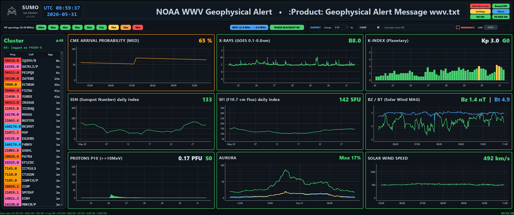
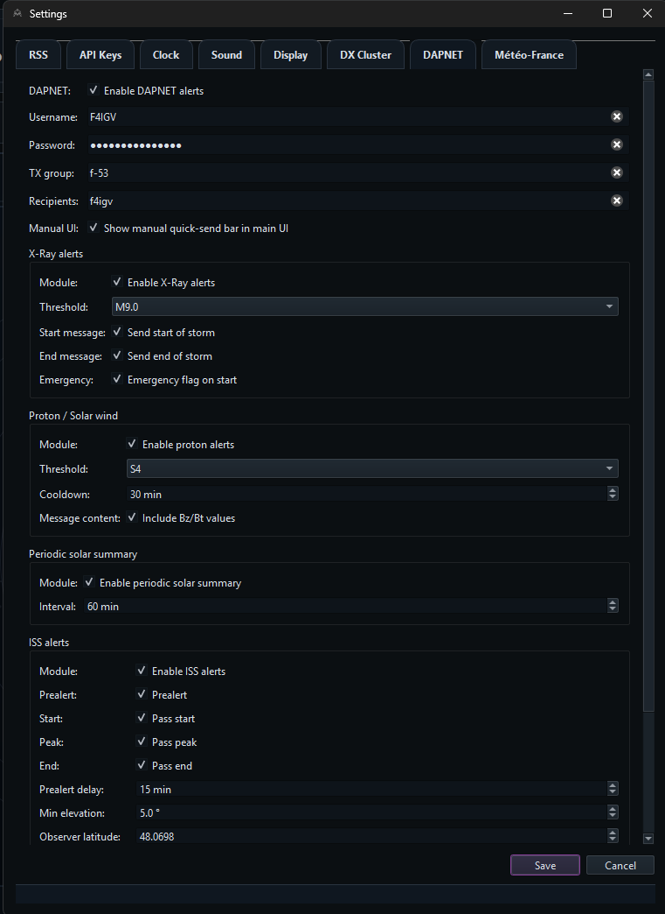
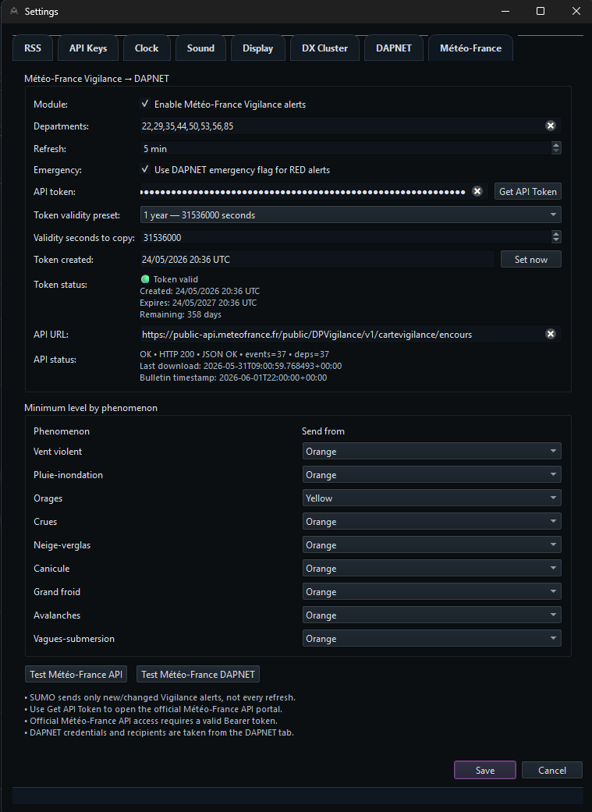
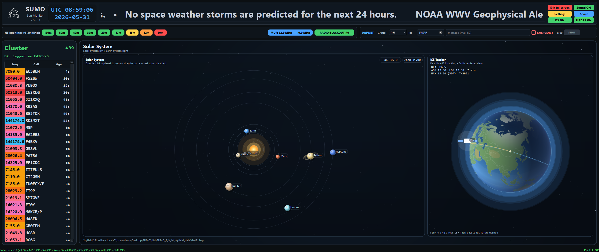
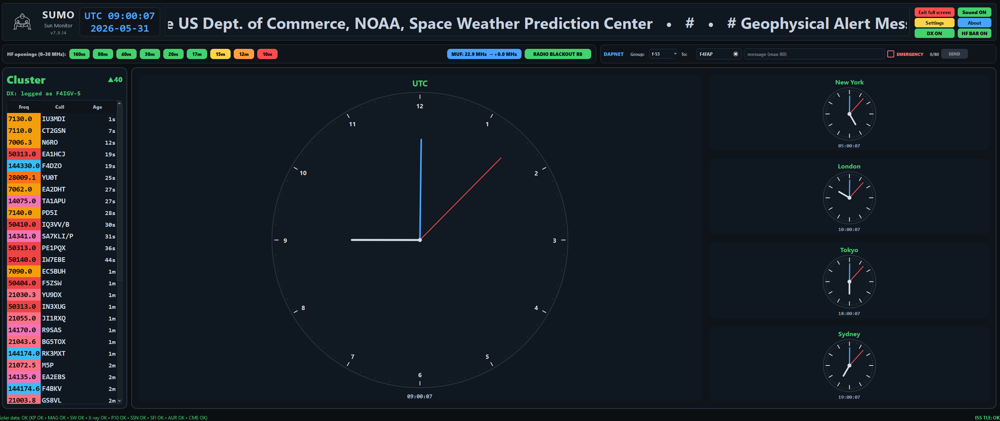
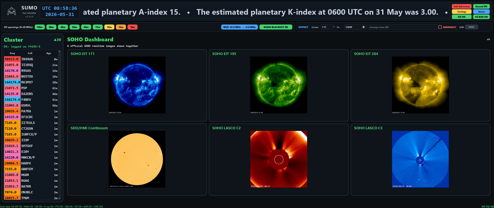
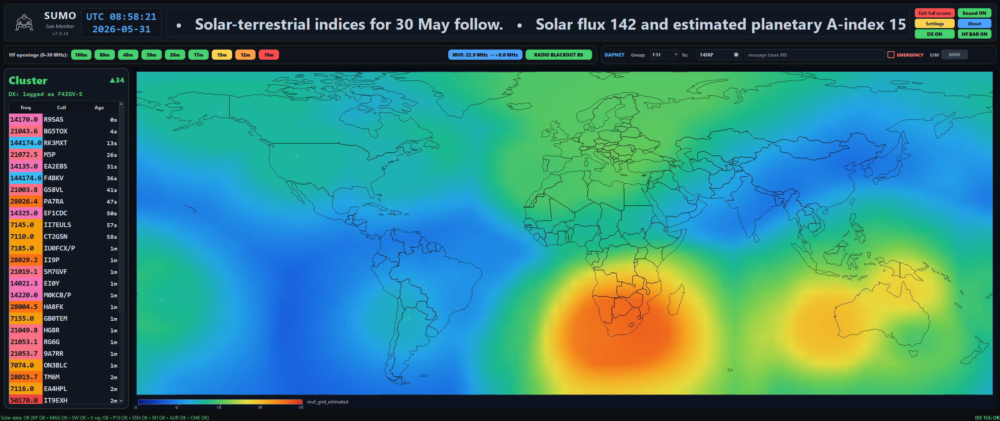

☀️ SUMO – Sun Monitor

SUMO (Sun Monitor) est une application de surveillance de la météo spatiale développée en Python et destinée aux radioamateurs, passionnés de propagation HF, écouteurs d'ondes courtes et observateurs de l'activité solaire.

L'application centralise dans une interface unique les principales données fournies par NOAA, NASA, SOHO, Celestrak et DAPNET afin d'offrir une vision en temps réel de l'environnement radioélectrique terrestre.

Fonctionnalités

📡 Surveillance de la météo spatiale

SUMO affiche en temps réel :

Indice planétaire Kp
Flux solaire SFI (F10.7)
Nombre de taches solaires (SSN)
Flux X-Ray GOES
Flux protonique GOES (>10 MeV)
Vitesse du vent solaire
Champ magnétique interplanétaire Bz/Bt
Prévisions aurorales NOAA
Événements CME via NASA DONKI

📈 Historique et visualisation

Chaque indicateur dispose :

d'un graphique historique
d'un système de couleurs cohérent
d'une représentation des tendances
d'une échelle temporelle basée sur les données NOAA
🚨 Système d'alertes

SUMO surveille automatiquement les changements d'état des différents indicateurs et peut :

modifier dynamiquement les couleurs des panneaux
déclencher des alertes sonores
mettre en évidence les événements importants
📟 Intégration DAPNET

Support complet du réseau DAPNET :

envoi manuel de messages
alertes météo spatiale
alertes Météo-France
notifications de passages ISS

Configuration :

identifiants DAPNET
groupe d'émission
seuils d'alerte
indicateur « Emergency »

🌦️ Vigilance Météo-France

SUMO peut surveiller les vigilances :

vent violent

orages

pluie-inondation

crues

canicule

neige-verglas

grand froid

avalanches

vagues-submersion

avec transmission automatique via DAPNET.

🛰️ Suivi de l'ISS

Calcul des passages ISS à partir des TLE Celestrak :

prévisions de passage
notifications automatiques
géolocalisation de l'observateur
calcul d'élévation et d'azimut

🌍 Horloges mondiales

Tableau de bord multi-fuseaux horaires comprenant :

horloge principale
horloges secondaires configurables
prise en charge des fuseaux horaires mondiaux

📷 Tableau de bord SOHO

Téléchargement automatique des images :

SOHO EIT 171
SOHO EIT 195
SOHO EIT 284
SOHO LASCO C2
SOHO LASCO C3
HMI Continuum

🌎 Carte MUF expérimentale

Module d'estimation de la MUF utilisant :

données ionosphériques
interpolation IDW
lissage multi-passes
génération de cartes Europe et Monde
📰 Flux d'informations

Intégration :

NASA Solar System News
bulletin NOAA WWV

avec affichage dans un bandeau défilant.

🛡️ Robustesse

SUMO intègre :

journalisation avancée
rotation automatique des logs
gestion des exceptions non interceptées
capture des crashs via faulthandler
mécanismes anti-blocage
Technologies utilisées
Python 3
PySide6
PyQtGraph
NumPy
Requests
SQLite
Skyfield
Sources de données
NOAA SWPC
NASA DONKI
NASA RSS
SOHO
Celestrak
DAPNET
Météo-France
Auteur

Yoann Daniel – F4IGV

Développé pour fournir aux radioamateurs un outil moderne de surveillance solaire et de suivi des conditions de propagation HF.
