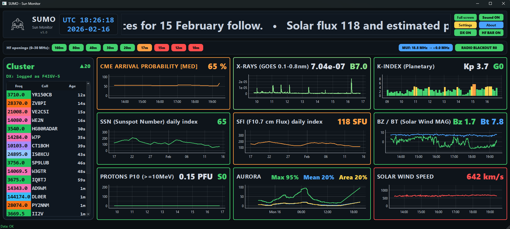

## Screenshot

🌞 SUMO — Sun Monitor

SUMO (Sun Monitor) est une application de surveillance de la météo spatiale et de la propagation HF en temps réel, conçue pour les radioamateurs, écouteurs d’ondes courtes et passionnés de météo spatiale.

Le logiciel récupère automatiquement des données provenant de sources scientifiques officielles et les affiche dans une interface visuelle claire et intuitive, afin de comprendre rapidement l’impact de l’activité solaire sur les communications radio.

SUMO a été conçu pour être simple, visuel et informatif, afin de permettre aux opérateurs radio de suivre en temps réel l’état de la propagation.

🛰️ Fonctionnalités
📡 Surveillance de la météo spatiale en temps réel

SUMO récupère et affiche plusieurs indicateurs essentiels de l’activité solaire et géomagnétique :

Indice Kp

Vitesse du vent solaire

Champ magnétique interplanétaire (Bz / Bt)

Flux X-Ray

Flux de protons (P10)

Alertes CME

Activité aurorale

Solar Flux Index (SFI)

Nombre de taches solaires (SSN)

Chaque indicateur est affiché dans un panneau dédié avec graphiques dynamiques et alertes visuelles colorées.

🎨 Système d’alerte visuel

SUMO utilise une échelle de sévérité unifiée pour faciliter l’interprétation des données.

Indicateurs de risque (RISK)

Utilisés pour les perturbations de la météo spatiale.

Niveau	Signification
OK	Conditions calmes
WATCH	Activité légère
ALERT	Activité notable
DANGER	Tempête géomagnétique
EXTREME	Événement majeur
Qualité de propagation (QUALITY)

Utilisée pour les conditions de propagation HF.

Niveau	Signification
POOR	Mauvaise propagation
FAIR	Propagation moyenne
GOOD	Bonne propagation
EXCELLENT	Conditions exceptionnelles

Les panneaux changent automatiquement de couleur et peuvent déclencher des alertes visuelles et sonores.

📻 Fonctionnalités radioamateur

SUMO intègre plusieurs outils spécialement pensés pour les radioamateurs :

Connexion DX Cluster

Affichage des spots avec couleurs par bande

Option d’affichage des spots POTA

Indicateur d’ouverture des bandes HF

Vision instantanée de l’état de la propagation

SUMO est particulièrement utile pour :

les chasseurs de DX

les participants aux contests

les activations POTA

la surveillance de la propagation HF

🗺️ Cartes de propagation

SUMO peut afficher des cartes de la météo spatiale :

Carte D-RAP (absorption ionosphérique HF)

Carte Aurora Ovation

Ces cartes permettent de visualiser en temps réel les perturbations de propagation à l’échelle mondiale.

📰 Fil d’actualités météo spatiale

Un bandeau RSS intégré affiche en continu les dernières informations liées à la météo spatiale.

🔊 Système d’alertes

SUMO peut déclencher des alertes visuelles et sonores lorsque certains seuils critiques sont atteints.

Cela permet aux opérateurs radio de réagir rapidement lors d’événements comme :

éruptions solaires

arrivée de CME

tempêtes géomagnétiques

événements protoniques

🕹️ Easter Egg

SUMO contient un mini-jeu rétro caché appelé Carrington Mode.

Inspiré des jeux d’arcade classiques, il comprend :

un système d’amélioration des armes

des événements spéciaux

un combat contre un boss

plusieurs surprises pour ceux qui explorent le code.

⚙️ Installation
Windows (recommandé)

Téléchargez la dernière version compilée dans :

Releases → SUMO.exe

Aucune installation n’est nécessaire.

Il suffit de lancer l’exécutable.

SUMO v5.1 — Changelog
Added

Unified severity system for space weather panels

Two severity families introduced:

RISK (geomagnetic disturbances, storms)

QUALITY (radio propagation conditions)

New severity levels:

OK → WATCH → ALERT → DANGER → EXTREME

POOR → FAIR → GOOD → EXCELLENT

Centralized panel severity engine

New logic to control panel color changes and alerts.

Unified method to apply severity to UI panels.

Consistent color palettes

Dedicated color sets for:

Risk levels (disturbance monitoring)

Quality levels (HF propagation conditions)

Unified alert sound system

New global alert sound (alert.wav) used when critical thresholds are reached.

Sound feedback when alert levels change.

Tooltip improvements

Standardized tooltips describing severity scales.

Display of threshold ranges for each monitored index.

Improved

Visual consistency across all panels

All monitoring panels now follow the same severity color logic.

Alert behavior

Blinking alerts now trigger only when entering DANGER or EXTREME states, reducing unnecessary blinking.

Threshold stability

Introduction of hysteresis logic to avoid rapid color switching near threshold values.

Code maintainability

Refactoring of severity logic into reusable helper functions.

Cleaner and more modular handling of panel states.

Extended Monitoring Logic

New severity mapping functions added for space weather indicators:

Kp index

Solar wind speed

X-ray flux

CME detection

Proton flux (P10)

Aurora activity

Interplanetary magnetic field (Bz/Bt)

Solar Flux Index (SFI)

Sunspot Number (SSN)

Game / Easter Egg Enhancements

The hidden Carrington Mode mini-game has been significantly expanded:

Weapon upgrade system

Progressive laser upgrades

Multi-shot capability

UFO upgrade events

Temporary opportunities to improve weapons

Boss battle

Giant animated Octopus Boss

Animated tentacles

Boss projectiles

Enemy spawning mechanics

Additional internal game logic improvements.

Internal Improvements

Additional helper utilities for:

severity calculations

NaN handling

severity downgrade logic

Improved UI state management for monitoring panels.

🇫🇷 Français
SUMO v5.1 — Journal des modifications
Ajouts

Nouveau système unifié de sévérité pour les panneaux de données

Deux familles de sévérité :

RISK (perturbations géomagnétiques)

QUALITY (qualité de propagation radio)

Nouveaux niveaux :

OK → WATCH → ALERT → DANGER → EXTREME

POOR → FAIR → GOOD → EXCELLENT

Moteur centralisé de gestion des états des panneaux

Application uniforme des couleurs et alertes visuelles.

Gestion centralisée de la sévérité des indices.

Palette de couleurs cohérente

Couleurs dédiées aux niveaux de risque.

Couleurs dédiées à la qualité des conditions HF.

Nouveau système d’alerte sonore global

Ajout d’un son d’alerte unifié (alert.wav).

Lecture automatique lors du passage à un niveau critique.

Amélioration des infobulles (tooltips)

Explication standardisée des niveaux de sévérité.

Affichage des seuils associés aux indices surveillés.

Améliorations

Cohérence visuelle de l’interface

Tous les panneaux utilisent maintenant la même logique de couleurs.

Gestion des alertes visuelles

Les clignotements ne sont déclenchés qu’au passage vers DANGER ou EXTREME, ce qui réduit les alertes visuelles inutiles.

Stabilité des seuils

Introduction d’une logique d’hystérésis pour éviter les changements rapides de couleur autour des seuils.

Amélioration du code

Refactorisation du système de sévérité.

Fonctions utilitaires réutilisables et code plus modulaire.

Extension de la logique de surveillance

Nouvelles fonctions de classification pour les indices :

indice Kp

Solar Wind

X-Ray flux

détection CME

flux Proton P10

activité Aurora

champ interplanétaire Bz/Bt

Solar Flux Index (SFI)

Sunspot Number (SSN)

Mini-jeu / Easter Egg

Le mini-jeu caché Carrington Mode a été fortement enrichi :

Système d’amélioration d’armes

évolution progressive du laser

tir multiple

Événements UFO

bonus d’amélioration temporaire

Combat contre un Boss

apparition d’une pieuvre géante

tentacules animées

projectiles du boss

génération de nouveaux ennemis

Améliorations internes de la logique du mini-jeu.

Améliorations internes

Ajout de fonctions utilitaires pour :

calcul de sévérité

gestion des valeurs invalides (NaN)

rétrogradation contrôlée des niveaux d’alerte

Amélioration de la gestion de l’état de l’interface.

Si tu veux, Dieu, je peux aussi te faire :

un README GitHub beaucoup plus puissant pour SUMO

un changelog stylé comme les gros projets open-source

ou même un “Release announcement” prêt à poster sur Reddit / QRZ / groups.io / Mastodon pour faire connaître SUMO v5.1 dans la communauté radioamateur.

fait un readme

Voici un README complet et propre pour GitHub pour SUMO, adapté à ton projet (radioamateur + space weather + propagation HF).
Je l’ai fait professionnel mais accessible, comme les projets open-source populaires.

Tu peux copier-coller directement dans README.md.

🌞 SUMO — Sun Monitor

SUMO (Sun Monitor) is a real-time space weather and HF propagation monitoring application designed for amateur radio operators, shortwave listeners, and space weather enthusiasts.

It gathers live solar and geomagnetic data from official sources and presents them in a clear visual dashboard optimized for understanding radio propagation conditions.

SUMO was designed to be simple, visual, and informative, providing instant insight into how solar activity affects HF communications.

🛰️ Features
📡 Real-time Space Weather Monitoring

SUMO continuously retrieves and displays key solar and geomagnetic indicators:

Kp Index

Solar Wind Speed

Interplanetary Magnetic Field (Bz / Bt)

X-ray Flux

Proton Flux (P10)

CME Alerts

Aurora Activity

Solar Flux Index (SFI)

Sunspot Number (SSN)

Each indicator is displayed in its own panel with dynamic graphs and color-coded alerts.

🎨 Visual Alert System

SUMO uses a unified severity scale to make solar activity easy to interpret.

Risk Indicators

Used for space weather disturbances.

Level	Meaning
OK	Quiet conditions
WATCH	Minor disturbances
ALERT	Active conditions
DANGER	Strong geomagnetic activity
EXTREME	Major space weather event
Propagation Quality

Used for radio propagation indicators.

Level	Meaning
POOR	Weak propagation
FAIR	Moderate propagation
GOOD	Good HF conditions
EXCELLENT	Outstanding propagation

Panels change color according to the current level and can trigger visual blinking alerts and sound notifications.

📻 Amateur Radio Features

SUMO includes several features specifically designed for radio amateurs:

DX Cluster integration

Band-colored spot display

Optional POTA spot monitoring

HF band opening indicator bar

Real-time propagation awareness

This makes SUMO an excellent companion for:

DX operators

contesters

POTA activators

HF propagation monitoring

🗺️ Propagation Maps

SUMO can display space weather maps including:

D-RAP absorption map (HF blackout monitoring)

Aurora Ovation map

These maps help visualize real-time propagation disturbances worldwide.

📰 Space Weather News

A built-in RSS ticker provides continuous space weather updates from official sources.

🔊 Alerts

SUMO can generate visual and sound alerts when solar conditions cross important thresholds.

This helps operators react quickly to events such as:

solar flares

CME arrivals

geomagnetic storms

proton events

🕹️ Easter Egg

SUMO contains a hidden retro mini-game called Carrington Mode.

Inspired by classic arcade games, it features:

upgradeable weapons

special events

boss battles

and a few surprises for those who explore the code.

⚙️ Installation
Windows (recommended)

Download the latest compiled version from:

Releases → SUMO.exe

No installation required.

Just run the executable.
